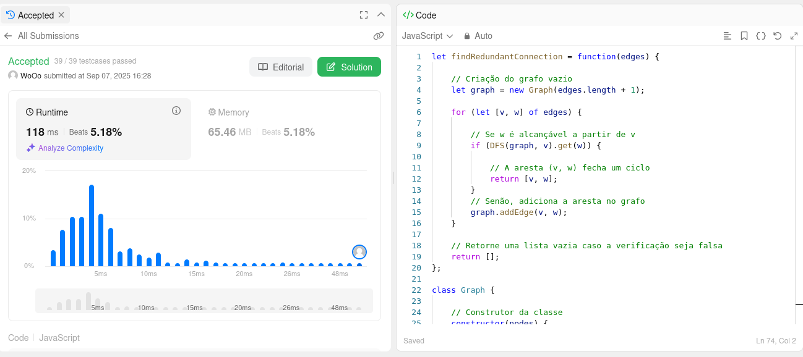
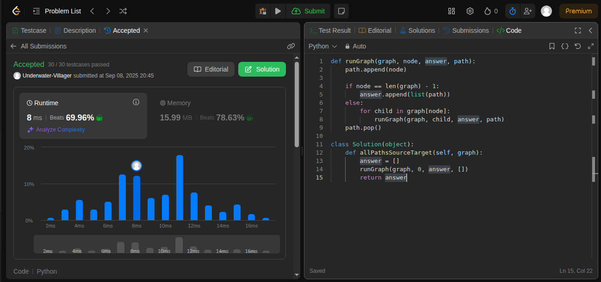
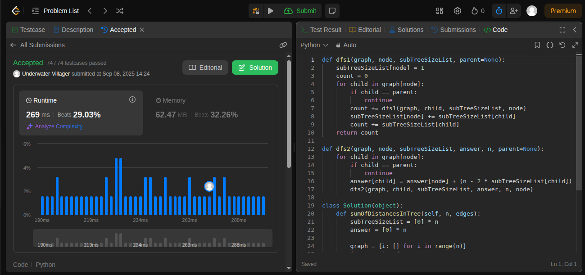

# Grafos1_LeetCode_Dupla13

**Número da Lista**: 1 
**Conteúdo da Disciplina**: Grafos 1 

## Alunos
|Matrícula | Aluno |
| -- | -- |
| 222006490  |  Vinícius de Jesus Bessa Fernandes |
| 231011865  |  Willian Wagner Xavier Ramos da Silva |

## Sobre 
[Descreva os objetivos do seu projeto e como ele funciona. ]: #
O trabalho realizado pela dupla 13 no módulo de grafos 1 consiste na resolução de exercícios quatro exercícios, sendo eles de dificuldade média ou difícil.

As seções abaixo informam a dificuldade de cada questão, linguagens utilizadas e as suas respectivas screenshoots para confirmação da submissão.

## Exercícios
| Nome | Dificuldade |
| -- | -- |
| [684. Redundant Connection](https://leetcode.com/problems/redundant-connection/description/)  |  Média |
| [797. All Paths From Source to Target](https://leetcode.com/problems/all-paths-from-source-to-target/description/)  |  Média |
| [834. Sum of Distances in Tree](https://leetcode.com/problems/sum-of-distances-in-tree/description/)  |  Difícil |
| [839. Similar String Groups](https://leetcode.com/problems/similar-string-groups/description/)  |  Difícil |

## Screenshots
[Adicione 3 ou mais screenshots do projeto em funcionamento.]: #
### Exercício 684. Redundant Connection (Média)

### Exercício 797. All Paths From Source to Target (Média) 

### Exercício 834. Sum of Distances in Tree (Difícil) 

### Exercício 839. Similar String Groups (Difícil)

## Linguagens 
[**Linguagem**: xxxxxx ]: #
[**Framework**: (caso exista)]: # 
[Descreva os pré-requisitos para rodar o seu projeto e os comandos necessários.]: #
JavaScript e Python

## Vídeo
[Explique como usar seu projeto caso haja algum passo a passo após o comando de execução.]: #

[▶️ Ver vídeo](https://youtu.be/QUV7gb6l6LA)
